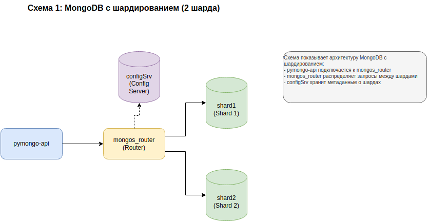
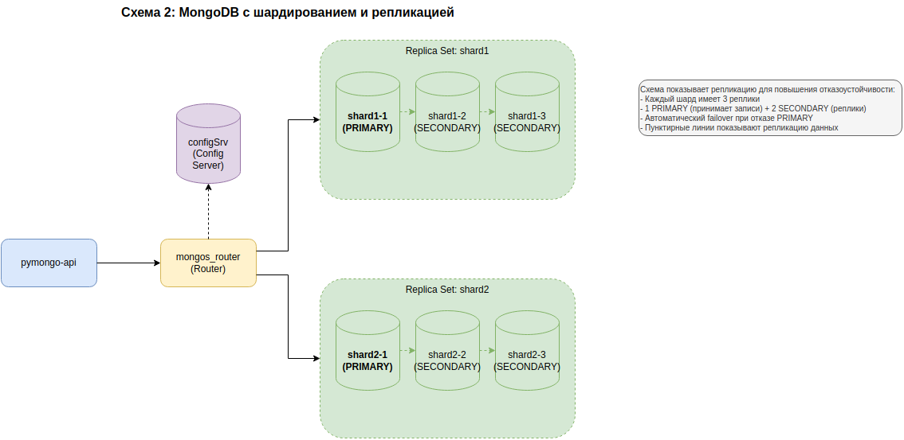
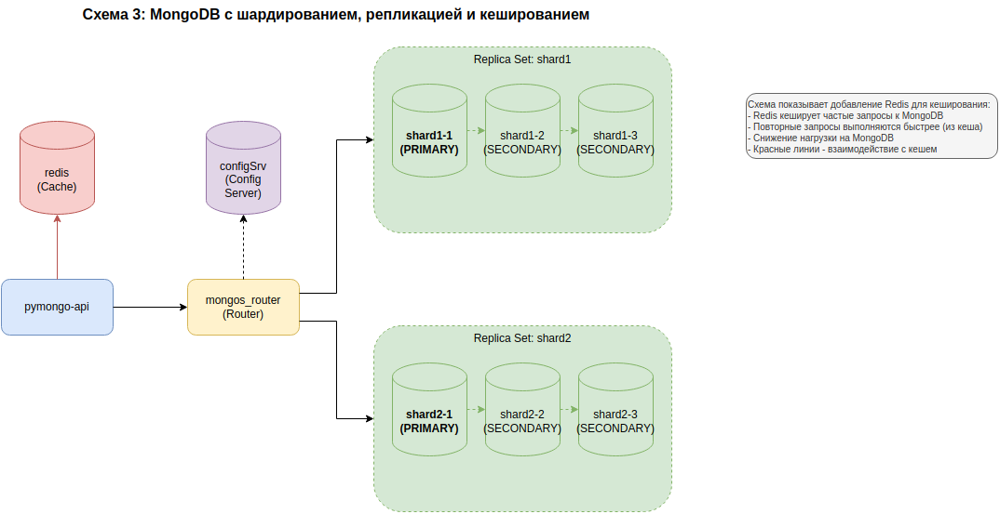
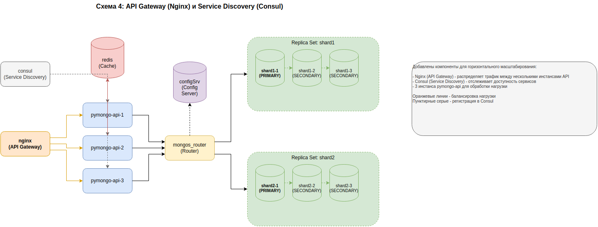
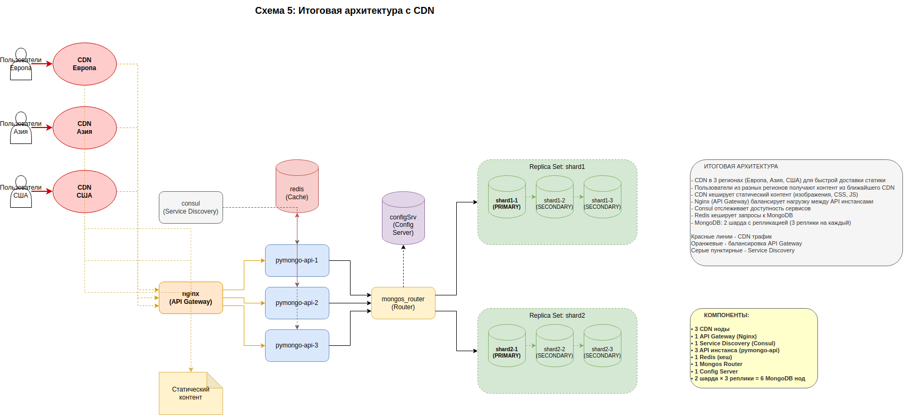

# Задание 1: Планирование архитектуры

## Описание

Задание 1 заключается в создании 5 схем эволюции архитектуры онлайн-магазина "Мобильный мир" от простого решения до высоконагруженной системы.

## Файлы схем

Все схемы созданы в формате draw.io:

1. **schema1_sharding.drawio** — Шардирование MongoDB (2 шарда)
2. **schema2_replication.drawio** — Шардирование + Репликация (3 реплики на шард)
3. **schema3_caching.drawio** — Шардирование + Репликация + Redis кеширование
4. **schema4_api_gateway.drawio** — + API Gateway (Nginx) + Service Discovery (Consul)
5. **schema5_final_with_cdn.drawio** — **ИТОГОВАЯ СХЕМА** + CDN в разных регионах

## Просмотр схем

### Вариант 1: PNG изображения (рекомендуется)

PNG автоматически генерируются через GitHub Actions при каждом push:

- 
- 
- 
- 
-  ← **ИТОГОВАЯ**

## Эволюция архитектуры

### Схема 1: Базовое шардирование

**Компоненты:**
- pymongo-api (приложение)
- mongos_router (маршрутизатор запросов)
- configSrv (сервер конфигурации)
- shard1, shard2 (2 шарда для распределения данных)

**Цель:** Горизонтальное масштабирование через шардирование данных между 2 шардами.

---

### Схема 2: Репликация

**Добавлено:**
- **Replica Set shard1:** shard1-1 (PRIMARY) + shard1-2, shard1-3 (SECONDARY)
- **Replica Set shard2:** shard2-1 (PRIMARY) + shard2-2, shard2-3 (SECONDARY)

**Цель:** Повышение отказоустойчивости через репликацию. Автоматический failover при отказе PRIMARY.

---

### Схема 3: Кеширование с Redis

**Добавлено:**
- **redis** — сервер кеширования

**Цель:** Повышение производительности через кеширование частых запросов к MongoDB. Повторные запросы выполняются быстрее (<100ms).

---

### Схема 4: API Gateway и Service Discovery

**Добавлено:**
- **nginx** — API Gateway для балансировки нагрузки
- **consul** — Service Discovery для отслеживания доступности сервисов
- **3 инстанса pymongo-api** (вместо одного) для обработки нагрузки

**Цель:** Горизонтальное масштабирование приложения с автоматическим обнаружением сервисов.

---

### Схема 5: Итоговая архитектура с CDN

**Добавлено:**
- **3 CDN ноды** в разных регионах (Европа, Азия, США)
- **Пользователи** из разных регионов
- **Статический контент** (изображения, CSS, JS)

**Цель:** Ускорение доставки статического контента пользователям в разных географических регионах.

---

## Итоговая конфигурация (Схема 5)

- ✅ 3 CDN ноды
- ✅ 1 API Gateway (Nginx)
- ✅ 1 Service Discovery (Consul)
- ✅ 3 API инстанса (pymongo-api)
- ✅ 1 Redis (кеш)
- ✅ 1 Mongos Router
- ✅ 1 Config Server
- ✅ 6 MongoDB нод (2 шарда × 3 реплики)

**Всего: 16 компонентов**

---

## Легенда компонентов

### Цвета на схемах

- **Синий** — Приложение (pymongo-api)
- **Желтый** — Маршрутизатор (mongos_router)
- **Фиолетовый** — Config Server
- **Зеленый** — MongoDB шарды и реплики
- **Красный** — Redis кеш
- **Оранжевый** — Nginx API Gateway
- **Серый** — Consul Service Discovery
- **Розовый** — CDN узлы

### Типы соединений

- **Сплошные стрелки** — Основные потоки данных
- **Пунктирные стрелки** — Репликация, конфигурация, service discovery
- **Красные стрелки** — Кеширование
- **Оранжевые стрелки** — Балансировка нагрузки

---

**Итоговый файл для проверки:**
- **Source:** `schema5_final_with_cdn.drawio`
- **Image:** `schema5_final_with_cdn.png` (автогенерируется)

Этот файл содержит полную архитектуру со всеми изменениями из заданий 1-6:
- ✅ Шардирование (2 шарда)
- ✅ Репликация (3 реплики на каждый шард)
- ✅ Кеширование (Redis)
- ✅ API Gateway (Nginx) и Service Discovery (Consul)
- ✅ CDN в разных регионах

---
